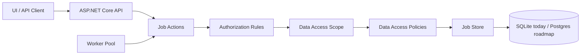
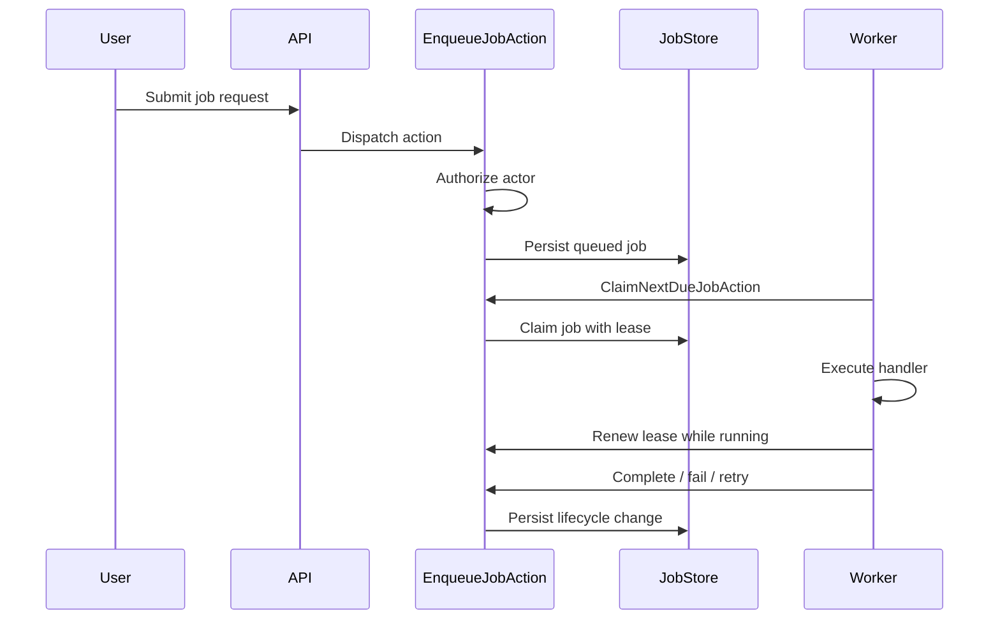

# Build a Distributed Job Scheduler in .NET

Reliable async systems with ASP.NET Core, background workers, leases, tenant-safe authorization, and the path from a single-process scheduler to distributed execution.

This repository is a learning-focused ASP.NET Core project for building a Hangfire-inspired job scheduler from first principles. It is not trying to be a drop-in replacement for Hangfire today. Instead, it explores the engineering decisions behind reliable asynchronous systems: durable job state, worker ownership, retries, leases, authorization boundaries, tenant-aware data access, and eventually distributed workers.

## What You Will Learn

- How jobs move through a durable lifecycle.
- How workers safely claim work.
- Why leases are needed when workers can crash.
- How lease renewal/heartbeat protects long-running execution.
- How failed jobs can retry or move to terminal states.
- How API and worker paths can share the same authorization model.
- How tenant-scoped data access can be enforced centrally.
- How read and mutate data policies differ.
- How to add guardrails so developers do not bypass approved mutation paths.
- How a scheduler can evolve toward API/worker split, Postgres atomic claims, worker autoscaling, and shard-aware processing.

## Current Capabilities

The current system supports:

- Enqueueing jobs through API/UI flows.
- Listing and inspecting job state.
- Background workers processing queued jobs.
- Multiple worker loops in one process.
- Worker claim ownership.
- Lease expiry and reclaim behavior.
- Lease renewal while jobs execute.
- Completion, failure, retry, and acknowledgement state changes.
- Job history / lifecycle state tracking.
- Actor-based authorization.
- Tenant-scoped data access.
- Table/entity-level data access policies.
- Separate read and mutate data-access behavior.
- Worker/service actors for internal processing.
- Analyzer guardrails around mutation/data-access boundaries.
- Tests around lifecycle, data-access policy translation, authorization, workers, and persistence.

## Why This Exists

A background job scheduler looks simple at first:

```text
enqueue job
run job later
mark done
```

Real systems quickly face harder questions:

- What if two workers claim the same job?
- What if a worker dies mid-execution?
- What if a lease expires while work continues?
- What if a tenant can see another tenant's job?
- What if a developer bypasses authorization accidentally?
- What if policy changes need to reach many machines?
- What if workers need to scale across nodes, queues, tenants, or shards?

This repo is a hands-on way to reason through those questions incrementally.

## Architecture At A Glance



Core principle:

```text
API and workers should go through the same action, authorization, and data-access path.
```

## Design Principles

- Keep job state durable.
- Make worker ownership explicit.
- Use leases to recover from worker failure.
- Keep tenant boundaries explicit and difficult to bypass.
- Treat cross-tenant access as privileged and auditable.
- Keep action authorization separate from data-access filtering.
- Keep table/entity policies close to the domain they protect.
- Prefer boring, observable coordination before adding queues or distributed machinery.
- Introduce distributed-system complexity only when it solves a clear problem.

## Current Domain Flow



## Authorization And Tenancy

A major theme of this repo is authorization correctness.

The project separates:

- Actor identity: who is performing the action.
- Worker/service identity: which system component is calling.
- Action authorization: whether the actor may perform the operation.
- Data-access policy: which rows/resources are visible or mutable.
- Tenant boundary: the non-negotiable isolation layer.

The current implementation keeps policies close to the job domain while using a shared authorization structure.

Long-term direction:

```text
Platform.Authorization
  shared actor model
  authorization evaluator
  common decision model
  data-access scope primitives

JobScheduler.Authorization
  scheduler-specific rules
  job lifecycle permissions
  job data-access policies

Analytics.Authorization
  analytics-specific rules
  metric/read-model visibility policies
```

## Learning Path

The repo can be read as a sequence of systems concepts:

1. Basic enqueue/list/detail flow.
2. Background worker processing.
3. Job lifecycle history.
4. Worker claim ownership.
5. Lease expiry and job reclaim.
6. Lease renewal while work is running.
7. Worker pool concurrency.
8. Actor model and permissions.
9. Tenant-scoped data access.
10. Read vs mutate data-access policies.
11. Action dispatcher and centralized authorization.
12. Guardrails against direct mutation/store bypasses.
13. Future API/worker process split.
14. Future Postgres atomic claim.
15. Future worker autoscaling and shard-aware processing.

## Roadmap Toward Distributed Execution

Planned topics and future work include:

- Split API and worker into separate runnable processes.
- Move from SQLite prototype persistence to Postgres.
- Implement atomic Postgres job claiming with `FOR UPDATE SKIP LOCKED` / `UPDATE ... RETURNING`.
- Add API-role and worker-role configuration.
- Add worker node identity and worker registry.
- Add metrics for queue depth, oldest due job age, claim rate, completion rate, retry rate, and lease loss.
- Add worker autoscaling signals based on backlog, latency, job duration, and downstream saturation.
- Add queue names, priorities, and worker subscriptions.
- Add per-tenant, per-queue, and per-job-type concurrency limits.
- Add active vs completed/archive job partitioning.
- Add tenant sharding with a tenant directory.
- Add shard-aware worker assignment.
- Add policy/config distribution using a Kubernetes-style `list/watch/resourceVersion` model.
- Add analytics read models with tenant-safe access.
- Explore queue integration only when DB polling or burst buffering becomes a real bottleneck.

## Compared To Mature Job Schedulers

Mature systems like Hangfire already provide many production features:

- Persistent storage.
- Multiple server instances.
- Named queues.
- Retries.
- Delayed and recurring jobs.
- Dashboard.
- Concurrency and rate limiting.
- Processing in separate processes or servers.

This repo is not currently a replacement for those systems. It is an engineering lab for understanding the design decisions behind reliable job processing, and for exploring additional concerns such as multi-tenant authorization, scoped data access, service actors, and guardrails against unsafe mutation paths.

## Future Scaling Model

The long-term scaling model is:

```text
API nodes are stateless.
Worker nodes are horizontally scalable.
The durable store coordinates job state.
Workers claim jobs atomically.
Tenant routing becomes the scaling axis.
Shard-aware workers process assigned shards/queues.
Analytics and observability are separated from the operational job path.
```

At higher scale, the system may evolve toward:

```text
Control plane
  tenant directory
  policy/config distribution
  worker assignments
  shard registry

Data plane
  Postgres shards
  active job partitions
  completed job archive
  analytics/read-model stores
```

## AI And Analytics Safety

The same authorization model can extend to AI and analytics services.

Principle:

```text
AI and analytics services should not bypass product authorization.
They should retrieve data and invoke tools through approved, scoped APIs.
```

Future topics include:

- Tenant-safe analytics read models.
- Prometheus/internal observability vs customer-facing analytics.
- AI/RAG retrieval through data-access policies.
- Tool invocation through the normal action dispatcher.
- Audit trails for AI retrieval and tool calls.
- Policy controls for exports, bulk actions, and sensitive dimensions.

## Running Locally

The local development URL is:

```text
http://localhost:5088
```

Use the HTTP requests under `requests/` and the UI pages to exercise enqueueing, listing, authorization, worker behavior, and acknowledgement flows.

## Status

This is an active learning/build project. The implementation intentionally evolves in small steps, with tests added around the parts where correctness matters most.

The project is currently best understood as:

```text
a reliable async systems learning repo
with a working job scheduler prototype
and a roadmap toward distributed, multi-tenant, policy-aware execution
```
